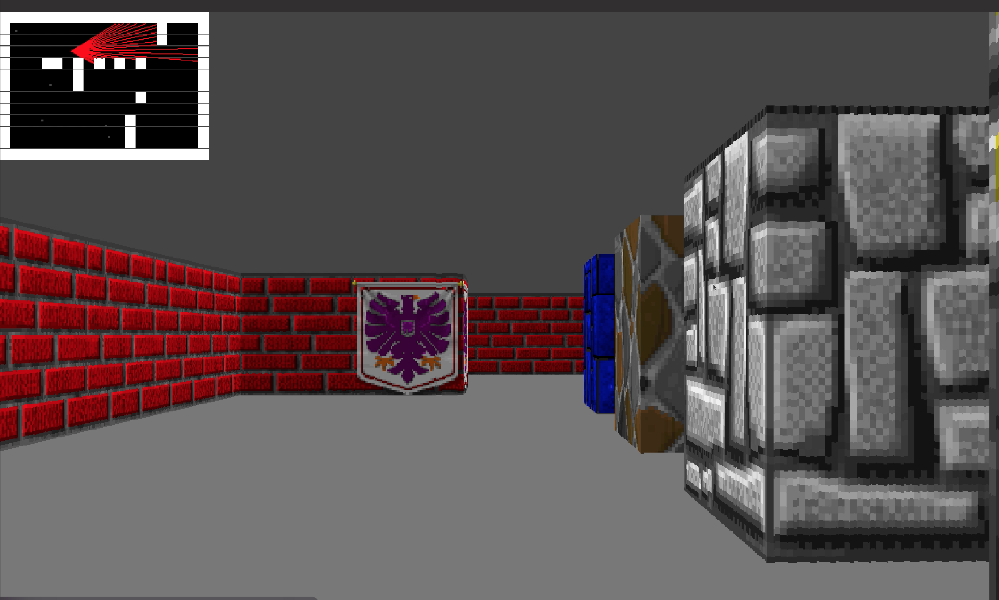

# Maze Project

The maze project is an adaptation of the `Wolfenstein 1981` game. The project uses the concept of Raycasting to serve as the viewpoint of the player, giving it a first-person player view. Maps in the game are created using 2D-matrix arrays, which are seen when the player's raycast touch the blocks of the map.
## Technologies Used
- [**C Programming Language**]
The project was done using C programming language which comes pre-installed in Operating System Ubuntu 22.04.4 LTS.
- [**SDL2**](https://wiki.libsdl.org/Installation) - Known as `Simple DirectMedia Layer` is a cross-platform software development library designed to provide a hardware abstraction layer for computer multimedia hardware components. Software developers can use it to write high-performance computer games and other multimedia applications that can run on many operating systems such as Android, iOS, Linux, macOS, and Windows. ([Wikipedia](https://en.wikipedia.org/wiki/Simple_DirectMedia_Layer)). In simple terms, it creates windows for any kind of media file, giving each window the ability to interact with the hardware components of a system(i.e Keyboard and mouse) and also the ability to quit, maximize or minimize each media file/application. This was used as the window that holds the entire functionality of the project.

## Usage
On the terminal run
```
make
```

This creates the executable file `maze` (which is currently in this GitHub repository). Then run this to start up the application.

```
./maze
```



## Reference
- [lazyfoo](http://lazyfoo.net/tutorials/SDL/index.php#Event%20Driven%20Programming)
- [geeksforgeeks](https://www.geeksforgeeks.org/structure-vs-class-in-cpp/)
- [permadi.com](https://permadi.com/1996/05/ray-casting-tutorial-1/)
- [lodev.org](https://lodev.org/cgtutor/raycasting.html)
- [cplusplus.com](https://cplusplus.com/forum/beginner/214311/)
- [pikuma.com](https://pikuma.com/courses/raycasting-engine-tutorial-algorithm-javascript)
- [3DSage/OpenGL-Raycaster](https://www.youtube.com/watch?v=gYRrGTC7GtA)